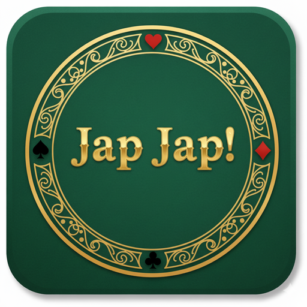

# Jap Jap! 🃏

<p align="center">
  
</p>

A browser-based card game implementation of "Jap Jap" (also known as "Knock" or "Thirty-One" in some regions), built with JavaScript and the cards.js library.

[](https://naereen.github.io/jap-jap.js/)
[](https://opensource.org/licenses/MIT)
[](https://developer.mozilla.org/en-US/docs/Web/Progressive_web_apps)

## Screenshots

### Game Start


### Gameplay


## 📖 About the Game

**Jap Jap** is a strategic card game where players aim to achieve the lowest hand value possible. The objective is to reduce your hand's total value to 5 or less, at which point you can call "JAP JAP!" to win the round. The first player to reach 90 points loses the game!

### Game Rules

1. **Setup**: Each player (you vs. the computer opponent) starts with 5 cards
2. **Hand Values**: Cards are valued by their rank (Ace=1, 2-10=face value, Jack=11, Queen=12, King=13)
3. **Gameplay**:
   - On your turn, select one or more cards from your hand to discard
   - Valid plays must be either:
     - Multiple cards of the same rank (e.g., three 5s)
     - A consecutive sequence of the same suit (e.g., 4♥, 5♥, 6♥)
   - After discarding, draw a card from either:
     - The deck (hidden card)
     - The discard pile (visible top card)
4. **Winning a Round**: When your hand value is 5 or less, click "JAP JAP!" to win the round
   - **Counter-Win Rule**: If you call "JAP JAP!" but an opponent has a hand with strictly fewer points, that opponent wins instead!
5. **Scoring**: The losing player of each round gains points equal to their hand value
6. **Game Over**: First player to reach 90 points loses the game

### Strategy Tips

- Try to form sequences or pairs early to discard high-value cards
- Watch the discard pile for cards that might help you complete a sequence
- Don't wait too long to call "JAP JAP!" - your opponent might beat you to it!
- **Be careful when calling "JAP JAP!"** - if an opponent has a strictly lower score, they'll win instead (counter-win rule)
- Sometimes it's worth picking up a high card from the discard pile if it helps you form a valid play

### AI Opponent Strategy

The computer opponents use an intelligent strategy system:

**Card Playing Strategy:**
- Evaluates all possible plays (pairs, sequences, single cards)
- Prioritizes discarding high-value cards to reduce hand score
- Gives bonus value to plays that discard multiple cards at once
- Considers whether remaining hand has good play opportunities
- Selects the optimal play based on weighted scoring

**Drawing Strategy:**
- Picks from discard pile when the top card can:
  - Complete or extend a pair/triplet (matching rank)
  - Form or extend a sequence (adjacent rank in same suit)
  - Replace high-value cards (picks low cards when holding high average hand value)
- Otherwise draws from the deck for unpredictability

**Winning Strategy:**
- Checks for "JAP JAP!" opportunity at the start of each turn
- Calls "JAP JAP!" immediately when hand value reaches 5 or less
- Reveals hand face-up when calling "JAP JAP!" for transparency

## 🎮 How to Play

1. Open `index.html` in your web browser
2. Click the **DEAL** button to start the game
3. Select cards from your hand by clicking on them (they'll move up when selected)
4. Click the **deck** to draw a hidden card, or click the **discard pile** to pick up the visible top card
5. When your hand value is 5 or less, click the **JAP JAP!** button to win the round

The game is also available in French by opening `index.fr.html`.

## 🚀 Getting Started

### Play Online

Visit [https://naereen.github.io/jap-jap.js/](https://naereen.github.io/jap-jap.js/) to play immediately in your browser.

### Run Locally

1. Clone the repository:
   ```bash
   git clone https://github.com/Naereen/jap-jap.js.git
   cd jap-jap.js
   ```

2. Open `index.html` in your web browser:
   ```bash
   # Using Python 3
   python3 -m http.server 8000
   # Then navigate to http://localhost:8000
   
   # Or simply open the file directly
   open index.html  # macOS
   xdg-open index.html  # Linux
   start index.html  # Windows
   ```

### Install as PWA on Android 📱

**Jap Jap!** is a Progressive Web App (PWA) that can be installed on your Android device for an app-like experience with offline functionality!

#### Installation Steps:

1. **Open the game in Chrome on Android:**
   - English version: [https://naereen.github.io/jap-jap.js/](https://naereen.github.io/jap-jap.js/)
   - French version: [https://naereen.github.io/jap-jap.js/index.fr.html](https://naereen.github.io/jap-jap.js/index.fr.html)

2. **Install the PWA:**
   - Tap the **menu icon** (three dots) in the top-right corner
   - Select **"Add to Home screen"** or **"Install app"**
   - Confirm the installation by tapping **"Install"** or **"Add"**

3. **Launch the app:**
   - Find the **Jap Jap!** icon on your home screen
   - Tap it to launch the game as a standalone app
   - The game will work even when you're offline! 🎉

#### PWA Features:

- **Offline Support**: Play the game without an internet connection thanks to the service worker
- **Home Screen Icon**: Quick access from your device's home screen
- **Standalone Mode**: Runs like a native app without browser UI
- **Fast Loading**: Cached resources load instantly
- **Auto-Updates**: The app automatically updates when changes are available

> **Note**: PWA installation is supported on most modern Android browsers (Chrome, Edge, Samsung Internet). On iOS, you can use "Add to Home Screen" in Safari for a similar experience, though offline functionality may be limited.

## 📁 Project Structure

- `index.html` - Main game page (English version)
- `index.fr.html` - French version of the game
- `sw.js` - Service worker for offline PWA functionality
- `manifest.json` - PWA manifest file for app metadata and icons
- `japjap.js` - Game logic and AI implementation
- `cards.js` - Card manipulation library by Einar Egilsson
- `example.css` - Game styling
- `jquery-1.7.min.js` - jQuery library for DOM manipulation
- `img/cards.png` - Card deck sprite sheet
- `img/icon-*.png` - App icons in various sizes (72x72 to 512x512)

## 🛠️ Technologies Used

- **HTML5** - Game structure
- **CSS3** - Styling and animations
- **JavaScript** - Game logic
- **jQuery** - DOM manipulation
- **[cards.js](http://einaregilsson.github.io/cards.js/)** - Card game framework

## 👥 Authors & Credits

### Game Author
- **Lilian Besson** ([Naereen](https://github.com/Naereen)) - Game design and implementation
  - Website: [https://perso.crans.org/besson/](https://perso.crans.org/besson/)
  - GitHub: [@Naereen](https://github.com/Naereen/)

### Cards.js Library
- **Einar Egilsson** - Creator of the cards.js library
  - Website: [http://einaregilsson.com](http://einaregilsson.com)
  - GitHub: [einaregilsson/cards.js](https://github.com/einaregilsson/cards.js)

### Card Artwork
- **Nicu Buculei** - Card deck images (public domain)
  - Website: [http://nicubunu.ro](http://nicubunu.ro)
  - Source: [OpenClipart.org](https://openclipart.org)

### Development Assistance
This project was developed with assistance from GitHub Copilot.

## 📄 License

Copyright (c) 2024 Lilian Besson (Naereen)

This game implementation is free and open source software distributed under the MIT License. You are free to use, modify, and distribute it.

### Third-Party Licenses

This project incorporates the following third-party components:

- **cards.js**: Licensed under the MIT License by Einar Egilsson (2012-2019) - see [LICENSE](LICENSE) file
- **Card Images**: Public domain by Nicu Buculei
- **jQuery**: Licensed under the MIT License

## 🤝 Contributing

Contributions, issues, and feature requests are welcome! Feel free to check the [issues page](https://github.com/Naereen/jap-jap.js/issues).

## 🌟 Show Your Support

Give a ⭐️ if you enjoy this game!

## 📝 Notes

- This game is still a work in progress
- The AI opponents use an intelligent strategy algorithm that evaluates plays strategically
- Mobile support may be limited due to the card selection mechanism

---

*Made with ❤️ by [Lilian Besson](https://github.com/Naereen)*
